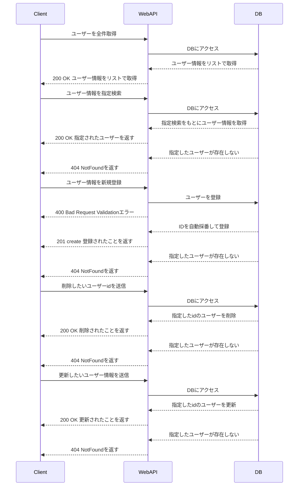

# SequenceDiagram

```mermaid
sequenceDiagram
    Client ->> WebAPI:ユーザーを全件取得
    WebAPI ->> DB:DBにアクセス
    DB -->> WebAPI:ユーザー情報をリストで取得
    WebAPI -->> Client:200 OK ユーザー情報をリストで取得

 Client ->> WebAPI:ユーザー情報を指定検索
　　WebAPI ->> DB:DBにアクセス
　　DB -->> WebAPI:指定検索をもとにユーザー情報を取得
　　WebAPI -->> Client:200 OK 指定されたユーザーを返す
　　　　　　　　　　　　　DB -->> WebAPI:指定したユーザーが存在しない
　　　　　　　　　　　　　WebAPI -->> Client:404 NotFoundを返す

Client ->> WebAPI:ユーザー情報を新規登録
　　WebAPI ->> DB:ユーザーを登録
WebAPI　-->> Client:400 Bad Request Validationエラー
　　DB -->> WebAPI:IDを自動採番して登録
　　WebAPI -->> Client:201 create 登録されたことを返す
　　　　　　　　　　　　　DB -->> WebAPI:指定したユーザーが存在しない
　　　　　　　　　　　　　WebAPI -->> Client:404 NotFoundを返す

Client ->> WebAPI:削除したいユーザーidを送信
　　WebAPI ->> DB:DBにアクセス
　　DB -->>　WebAPI:指定したidのユーザーを削除
　　WebAPI -->> Client:200 OK 削除されたことを返す
　　　　　　　　　　　　　DB -->> WebAPI:指定したユーザーが存在しない
　　　　　　　　　　　　　WebAPI -->> Client:404 NotFoundを返す

Client ->> WebAPI:更新したいユーザー情報を送信
　　WebAPI ->> DB:DBにアクセス
　　DB -->>　WebAPI:指定したidのユーザーを更新
　　WebAPI -->> Client:200 OK 更新されたことを返す
　　　　　　　　　　　　　DB -->> WebAPI:指定したユーザーが存在しない
　　　　　　　　　　　　　WebAPI -->> Client:404 NotFoundを返す


```
